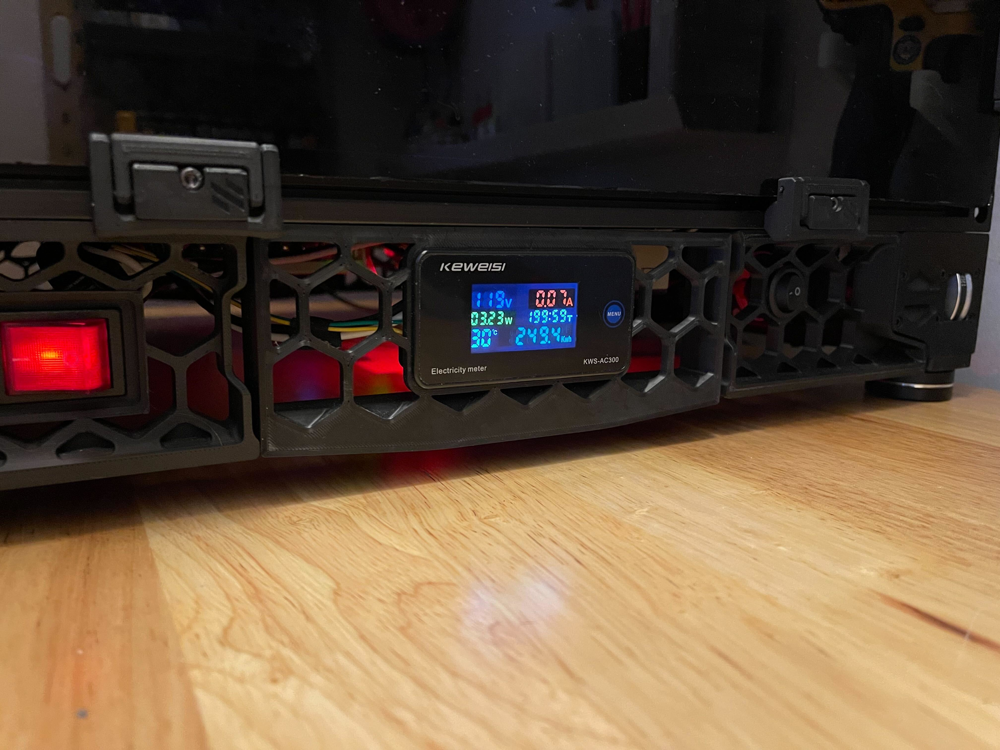

# Power Monitor Fan Skirt Mod

This mod was inspired by a mod by `leandromarceddu`, which you can find here: <https://github.com/VoronDesign/VoronUsers/tree/master/printer_mods/leandromarceddu/PowerSkirt>

This simple power monitor mount replaces the original skirt fan blanks and skirt fan assembly with a single peice version, intended to match aesthetics of the original.

Designed for a **V2.4r2 350mm**, I've included the STEP file and the Fusion360 project file if you'd like try adjusting the size

## BOM

- Power Monitor
  - <https://www.aliexpress.us/item/2255801081818196.html>

> [!IMPORTANT]
> To install this mod, you will be working with the mains, **UNPLUG FIRST** as this can be/is dangerous, as is also stated in the Voron Assembly instructions. **USE CAUTION** I am not responsible for damage to yourself or your printer.

## Installation

1. **Disconnect/unplug your printer from the main power source.**
2. First remove the old fan skirt + blanks. Save the M5 bolt, if you're installing skirts for the first time, please use the official Voron 2.4r2 bolt; `M5x10 BHCS`
3. Connect the screen's wires and temperature sensor (if you care to have it), I did this following the directions that came with the power monitor
4. Mount the power monitor fan skirt to the frame with the aforementioned M5 bolt
5. From the back (inside the electronics bay) turn the power monitor so that it goes through the hole in the skirt. Then orient it so that the menu button is on the right side.
6. Carefully pull the wire slack while first inserting the side of the power monitor where the wire exits, once flush, or close to flush, even out the distance between the power monitor and the skirt so that it can be pressed in completely. This method should help avoid pinching the wires.
7. Double check your wiring before reconnecting or plugging in the mains.
8. Reconnect/plug in the mains, power on. The screen should light up and it should display information.

## Images

